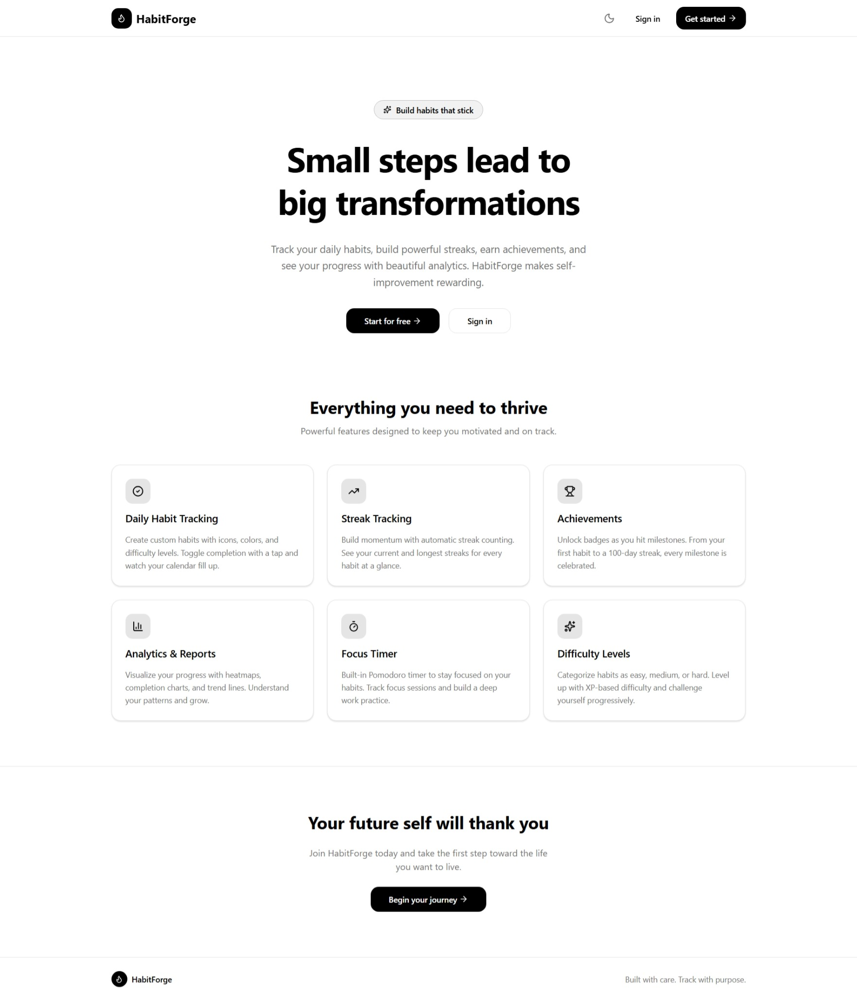
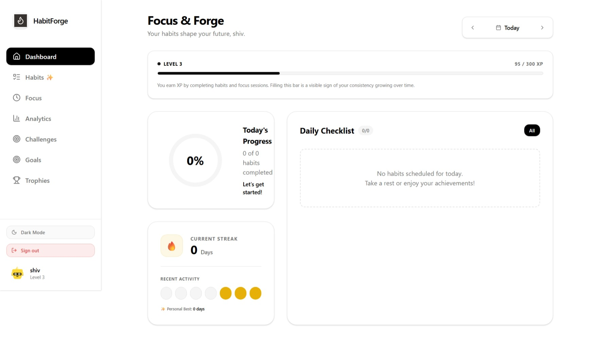
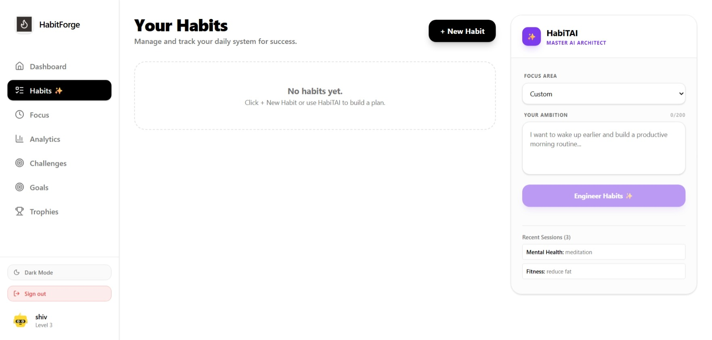
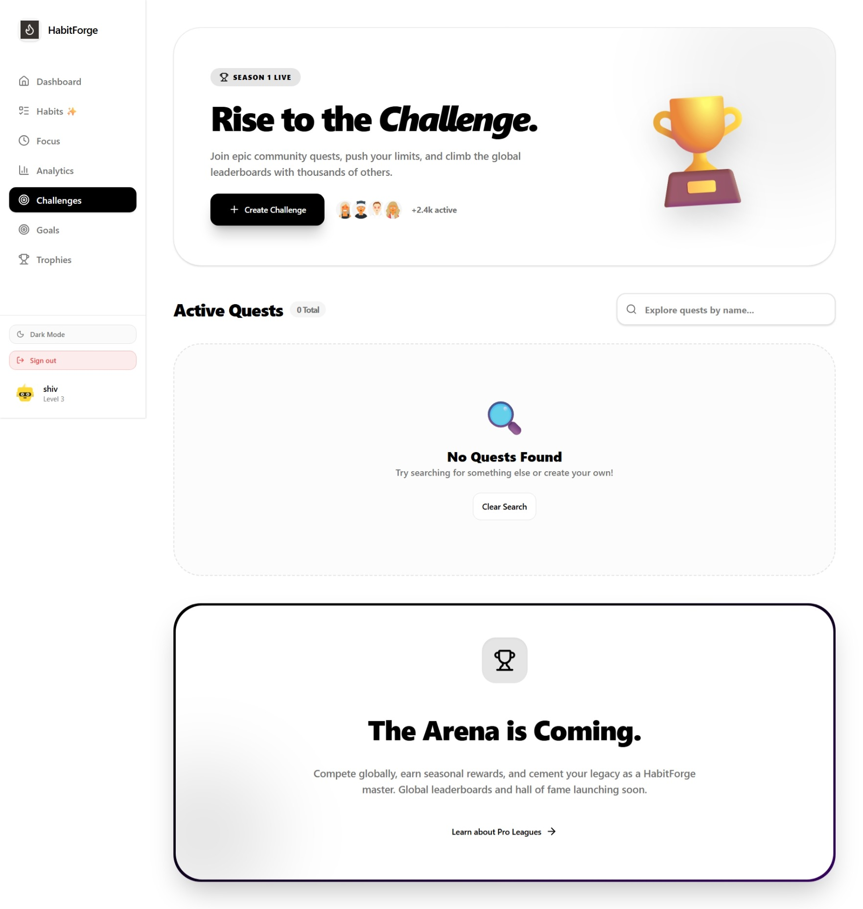
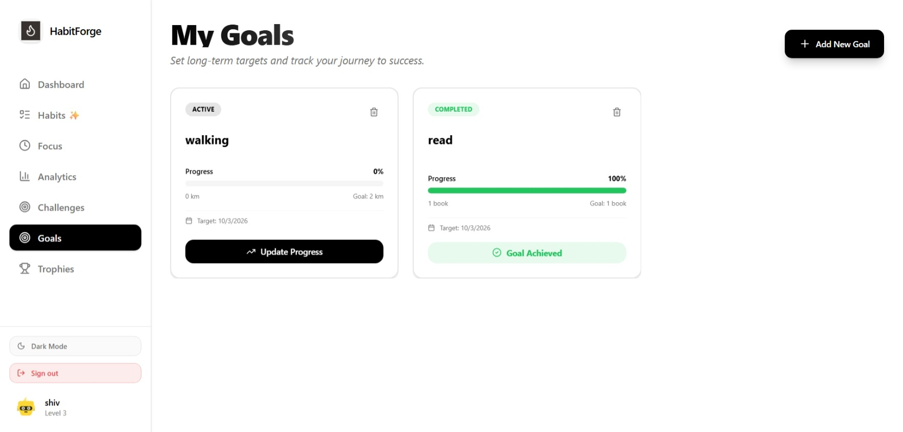
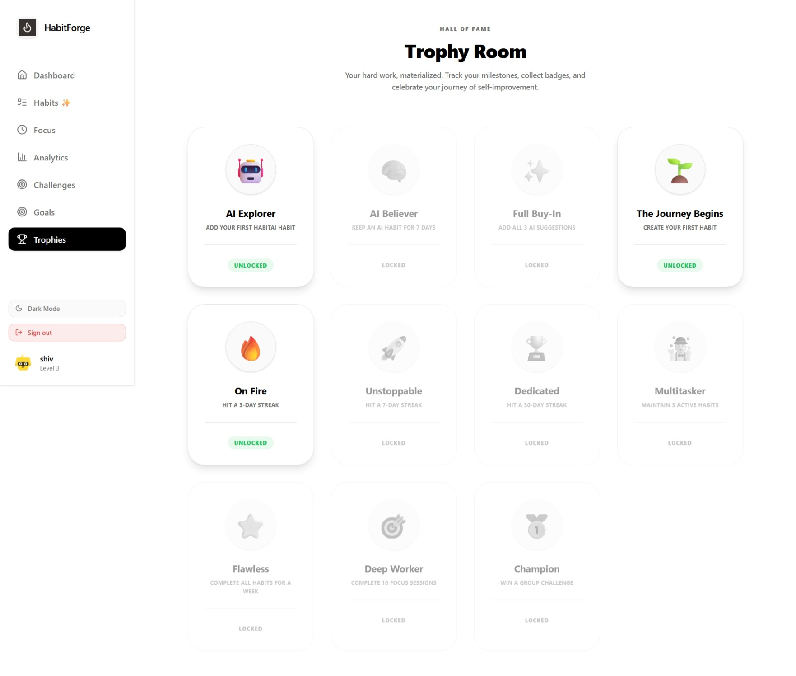

# HabitForge - Frontend

HabitForge is a gamified habit tracker designed to help users build better routines through consistency, AI-powered suggestions, and interactive progress tracking.

## Project Description
The frontend is a modern, responsive web application built with React and Vite. It features a stunning UI with glassmorphism effects, smooth animations (Framer Motion), and real-time feedback. Users can manage their habits, use AI to generate new ones based on their goals, track their focus with a Pomodoro timer, and earn badges in their personal "Trophy Room".

## Features
- **Interactive Dashboard**: Track daily habits and view progress with a 12-week heatmap.
- **HabiTAI**: AI-powered habit generation based on user goals and personality.
- **Focus Timer**: Integrated Pomodoro timer to help stay on task.
- **Gamification**: XP points, levels, ranks, and a rich achievement (badge) system.
- **User Profile**: Personalized profile with detailed statistics and progress tracking.

## Tech Stack Used
- **Core**: React 19, Vite 7
- **Styling**: Tailwind CSS 4, Lucide React (Icons)
- **Animations**: Framer Motion
- **Data Fetching**: Axios, React Query
- **Routing**: React Router DOM 7
- **Notifications/Effects**: Canvas Confetti, Shadcn UI

## Installation Steps
1. Navigate to the `frontend` directory:
   ```bash
   cd frontend
   ```
2. Install dependencies:
   ```bash
   npm install
   ```
3. Create a `.env` file and add your Supabase and API credentials:
   ```env
   VITE_SUPABASE_URL=your_supabase_url
   VITE_SUPABASE_ANON_KEY=your_supabase_anon_key
   VITE_API_URL=http://localhost:3001/api/v1
   ```
4. Run the development server:
   ```bash
   npm run dev
   ```

## Deployment Link
[Not currently deployed - Local Development Only]

## Backend API Link
The frontend communicates with the backend API at: `http://localhost:3001/api/v1`

## Login Credentials
Users can sign up for a new account or use existing test credentials if available in the Supabase instance.

## Screenshots

1. Landing Page


2. Dashboard


3. Habits Page


4. Focus


5. Analytics


6. Challenges


7. Goals


8. Achievements

